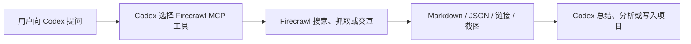
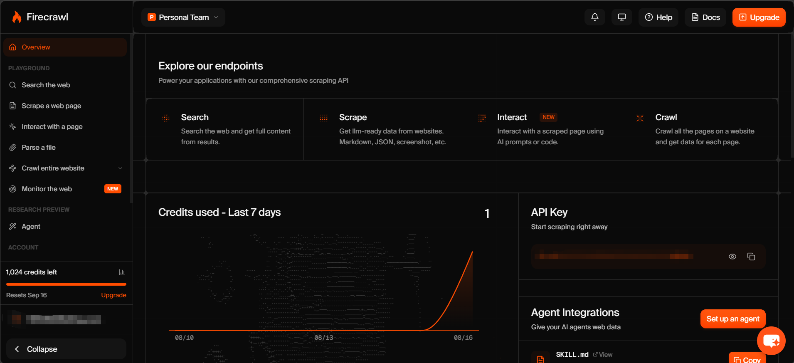
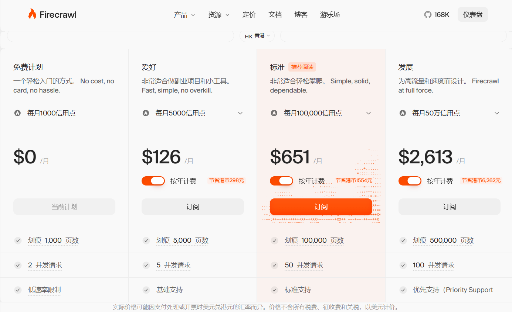

# Firecrawl：面向 AI Agent 的网页数据工具

> GitHub：[https://github.com/firecrawl/firecrawl](https://github.com/firecrawl/firecrawl)  
> 信息核对日期：2026-08-16  

## 1. 为什么需要 Firecrawl

大模型直接读取网页时经常遇到几个问题：页面包含导航栏、广告和脚本；内容依赖 JavaScript 渲染；信息分散在多个子页面；最终得到的 HTML 很长，却不适合直接交给模型分析。

Firecrawl 将网页访问封装为一组面向 AI 应用的接口：先在实时网络中寻找来源，再将网页转换为干净的 Markdown、结构化 JSON、链接、截图或元数据。它既提供托管 API，也开放核心项目源码，并可通过 SDK、CLI、MCP 接入 AI Agent。



## 2. 核心功能

| 功能 | 解决的问题 | 示例 |
|---|---|---|
| Search | 不知道目标网址时，搜索网页并返回来源 | 搜索某个框架的最新发布说明 |
| Scrape | 将单个 URL 转换为干净内容 | 把产品页提取为 Markdown 或 JSON |
| Map | 快速发现站点中的 URL | 找出文档站里的 API Reference 页面 |
| Crawl | 批量遍历一个站点或目录 | 将 `/docs/` 下的页面整理成知识库 |
| Parse | 将 PDF、DOCX 等文件转换为可用文本 | 解析公开报告或技术白皮书 |
| Interact | 在抓取后继续点击、输入、滚动或翻页 | 打开分页列表并提取后续内容 |
| Agent | 按目标自主寻找和整理信息 | 收集若干公司的产品与定价信息 |
| Monitor | 定期检查网页变化 | 监控竞品价格页或更新日志 |

Firecrawl 的重点不是单纯“打开网页”，而是把网络内容整理成适合模型消费的数据。对于普通文章页，优先使用 `Scrape`；只有必须点击、登录或翻页时，才升级到 `Interact`，这样更快，也更节省额度。

## 3. 常见应用场景

- **RAG 与知识库**：抓取产品文档，清理导航和页脚，再按页面或段落建立索引。
- **调研与信息检索**：先 Search 找来源，再 Scrape 重点页面，并保留 URL 便于核验。
- **竞品监控**：定期检查价格、功能列表、更新日志和招聘页面的变化。
- **结构化数据采集**：按 JSON Schema 提取商品名称、价格、规格或公司信息。
- **网站迁移与内容盘点**：先 Map 获取站点结构，再 Crawl 指定目录，而不是无边界抓取。
- **Agent 工具调用**：通过 MCP 让 Codex、Cursor 等客户端按任务自动选择搜索、抓取或交互工具。

## 4. 在 Codex 中使用

### 4.1 接入方式

本次采用 **MCP 接入**：Codex 连接 Firecrawl 官方托管的 Streamable HTTP MCP，并通过环境变量读取 API Key。整个过程不需要在本机部署 Firecrawl 服务，PowerShell 在任意文件夹中打开均可。

首先在 Firecrawl 控制台创建 API Key。若终端提示“`codex` 不是命令”，先安装 Codex CLI；已经能运行 `codex --version` 时可跳过安装命令。



```powershell
# 仅在没有 codex 命令时执行
npm.cmd install -g @openai/codex@latest
codex --version

# 将 API Key 保存为 Windows 用户环境变量；输入内容不会出现在命令历史中
$key = Read-Host "Paste your Firecrawl API key"
[Environment]::SetEnvironmentVariable("FIRECRAWL_API_KEY", $key, "User")
$env:FIRECRAWL_API_KEY = $key
Remove-Variable key

# 添加 Firecrawl 官方远程 MCP
codex mcp add firecrawl `
  --url https://mcp.firecrawl.dev/v2/mcp `
  --bearer-token-env-var FIRECRAWL_API_KEY

codex mcp list
```

如果先前添加过同名但无法启动的本地配置，应先执行 `codex mcp remove firecrawl`，再重新运行添加命令。配置完成后，彻底退出并重启 Codex 桌面应用，创建一个新任务，在对话框输入 `/mcp`；看到 `firecrawl_scrape`、`firecrawl_search` 等工具即表示接入成功。旧任务通常不会动态获得新接入的 MCP 工具。

### 4.2 演示一：单页抓取

```text
必须使用 Firecrawl MCP 的 firecrawl_scrape 工具抓取
https://firecrawl.dev，只保留主要内容并概括核心功能。
请报告实际调用的工具名称；如果不可用，不要改用其他网页工具。
```

观察重点：Codex 显示工具调用；参数包含 `onlyMainContent: true`；返回结果是清理后的 Markdown，而不是完整 HTML。

### 4.3 演示二：先发现、后抓取

```text
使用 Firecrawl MCP 的 map 功能查找 https://docs.firecrawl.dev 中
与 MCP、Scrape 和 Interact 有关的页面，只列出最相关的 6 个 URL，
不要启动全站 Crawl。
```

这个示例体现了成本控制：先 Map 缩小范围，再对少量目标页面 Scrape。演示时不建议直接爬取大型站点。

### 4.4 MCP 与 Skills 的关系

- **MCP 提供能力**：把 `firecrawl_scrape` 等真实工具暴露给 Codex。
- **Skill 提供方法**：告诉 Codex 何时选 Search、Scrape、Crawl 或 Interact。
- 仅使用 MCP 即可完成工具调用；Skills 是可选增强，不是连接 Firecrawl 的前置条件。

## 5. 收费与额度



Firecrawl 免费计划每月提供 **1,000 credits**。常见任务的消耗可以按以下方式估算：抓取一个普通网页约需 **1 credit**；一次返回不超过 10 条结果的 Search 约需 **2 credits**；Crawl 通常按实际处理的页数计算，例如抓取 20 个页面约需 **20 credits**。因此，免费额度大致可支持 1,000 次普通单页抓取，或约 50 次、每次 20 页的小规模 Crawl。

以上是便于理解的估算。Interact、AI 提取和高级输出可能产生额外消耗，实际用量应以 Firecrawl 控制台和最新价格说明为准。演示时限制 Crawl 页数，能够避免一次任务消耗过多额度。

## 6. Firecrawl 与 browser-act 对比

两者都有网页访问和交互能力，但设计中心不同：Firecrawl 以“获得可供模型使用的数据”为中心，browser-act 以“让 Agent 操作完整浏览器”为中心。

| 维度 | Firecrawl | browser-act |
|---|---|---|
| 主要定位 | Web 数据 API 与内容处理流水线 | 面向 Agent 的浏览器自动化 CLI |
| 典型输入 | 查询、URL、站点范围、提取 Schema | 导航和交互指令、浏览器与会话 |
| 典型输出 | Markdown、JSON、链接、元数据、截图、站点语料 | 页面快照、元素索引、截图、网络记录、操作结果 |
| 执行方式 | 官方云服务，也可自托管；支持 API、SDK、MCP、CLI | 运行完整浏览器；支持本地 Chrome、隐私/固定身份浏览器模式 |
| 批量内容 | Map、Crawl、Batch Scrape 更直接 | 更适合按交互流程逐步操作，也支持多浏览器并行与隔离 |
| 登录与会话 | Interact 和持久化 profile 可保存浏览器状态 | 强调复用本地登录、多账号隔离和人工接管 |
| 人机协作 | 提供 Live View；重点仍是抓取和数据输出 | 提供 headed 模式、Remote Assist 和敏感操作确认机制 |
| 使用成本 | 云 API 按 credits 和套餐计费 | 取决于 browser-act 的安装与所选运行服务；应以其当前文档为准 |

### 如何选择

- 已知 URL，只想得到正文或结构化数据：优先 Firecrawl Scrape。
- 要建立整个文档站的语料库：优先 Firecrawl Map/Crawl。
- 要操作现有登录态、上传文件、测试复杂 UI 流程或需要人工接管：优先 browser-act。
- 页面需要点击后才能取数：两者都能处理。若目标是稳定的数据产物，可用 Firecrawl Interact；若目标是复现用户操作过程、检查页面行为或管理多个浏览器身份，可用 browser-act。
- 二者可以组合：Firecrawl 负责搜索、批量发现和清洗；browser-act 负责少数高度交互、需要本地会话或人工协助的步骤。

## 参考资料

### 官方资料与源码

1. [Firecrawl 主仓库（AGPL-3.0）](https://github.com/firecrawl/firecrawl)
2. [Firecrawl 官方文档](https://docs.firecrawl.dev/)
3. [Firecrawl MCP Server](https://github.com/firecrawl/firecrawl-mcp-server)
4. [Firecrawl MCP 文档](https://docs.firecrawl.dev/mcp)
5. [Firecrawl Interact 文档](https://docs.firecrawl.dev/features/interact)
6. [Firecrawl 价格与 credits](https://www.firecrawl.dev/pricing)
7. [OpenAI：在 Codex 中配置 MCP](https://developers.openai.com/codex/mcp)
8. [BrowserAct Skills 与官方文档入口](https://github.com/browser-act/skills)
9. [BrowserAct 文档概览](https://github.com/browser-act/skills/blob/main/docs/README.md)

### 视频教程（第三方，界面和命令可能随版本变化）

1. [YouTube：Firecrawl Full Beginner Course | Let's Scrape EVERYTHING](https://www.youtube.com/watch?v=tBtPSV_gU6o)
2. [YouTube：Scrape ANY Website With AI For FREE with Firecrawl](https://www.youtube.com/watch?v=2s2aR4rOQ8Y)
3. [哔哩哔哩：什么 MCP 工具值得装？Firecrawl](https://www.bilibili.com/video/BV1ym9CYMExj/)
4. [哔哩哔哩：Firecrawl MCP 快速克隆网站](https://www.bilibili.com/video/BV1tgPie2Ett/)
